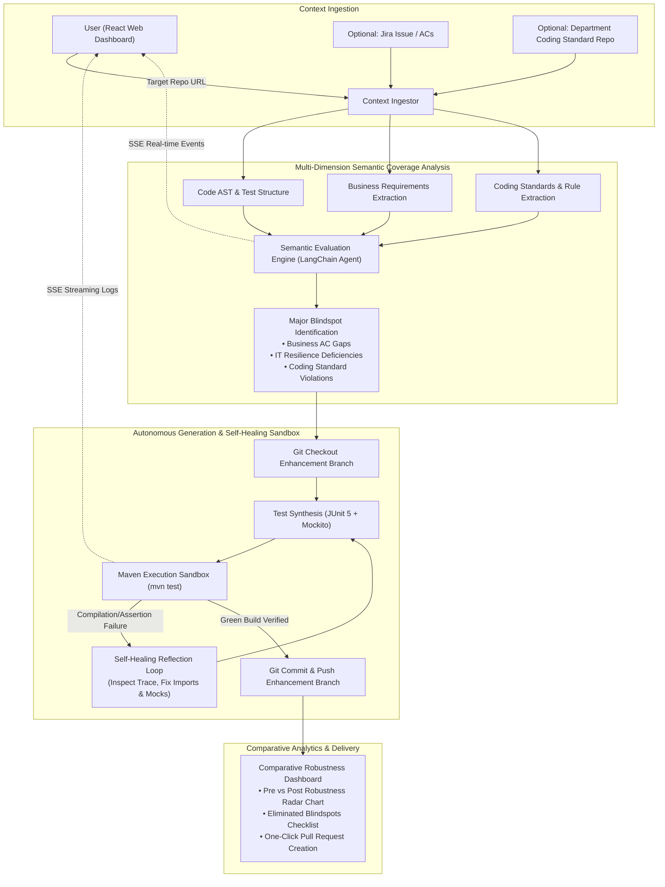

# AutoTestAgent (SentinelQA) 🛡️🤖

> **Autonomous AI Agent for Semantic Quality Assurance, Self-Healing Test Generation & Comparative Robustness Analytics**

[](LICENSE)
[](#)
[](#)

---

## 📖 1. Project Background & Motivation

In enterprise software engineering (especially within high-stakes domains like Financial Technology, Banking, and Regulatory Systems), **code quality and regression safety** are paramount. However, traditional automated testing practices face four major bottlenecks:

1. **The "JaCoCo Illusion" (Cold & Misleading Metrics)**: Traditional line/branch coverage tools (e.g., JaCoCo, Cobertura) provide sterile numbers. An 85% line coverage report often conceals the fact that tests are merely calling getters/setters or mocking out critical paths without asserting actual business rules.
2. **Business vs. Tech Disconnect**: Unit and integration tests rarely map back to real **Business Requirements** (User Stories, Acceptance Criteria in Jira/PRDs). Engineers and managers struggle to answer: *"Is our critical overdraft calculation or sanction screening rule actually tested?"*
3. **Passive Reporting without Remediation**: Traditional linters and QA tools complain about missing tests or untested branches, but they burden developers with tedious manual test scripting.
4. **Lack of Executive-Level Quality Visibility**: Reviewers, POs, and Tech Leads lack intuitive, side-by-side comparative dashboards showing how a new PR/branch actually bolsters the system's real-world robustness.

**AutoTestAgent** transforms testing from a passive check into an **autonomous, proactive engineering partner**.

---

## 🎯 2. Core Capabilities & Value Proposition

Given a **GitHub Repository URL**, an optional **Jira Issue ID / Requirement Doc**, and an optional **Department Coding Standard GitHub Repository**, AutoTestAgent executes an end-to-end autonomous QA workflow:



### 1. Multi-Dimension Semantic Coverage (Business, IT & Coding Standards)
Instead of cold line percentages, AutoTestAgent evaluates code across comprehensive human-readable dimensions:
- **Business Dimension (Acceptance Criteria Traceability)**: Parses requirements from Jira or repository specs, extracts business assertions, and maps them to existing test scenarios item-by-item.
- **IT & Robustness Dimension**: Identifies critical boundary and resilience gaps (e.g., `Null/Empty Payloads`, `Timeout & Retry Scenarios`, `Transaction Rollback under Concurrent Failures`, `Idempotency Violations`).
- **Department Coding Standard Compliance**: Ingests an optional dedicated GitHub repository documenting team/departmental coding standards (e.g., architectural conventions, naming rules, test structure guidelines, security constraints, and mandatory assertions) to ensure generated tests strictly align with organizational best practices.
- **High-Readability Output**: Renders itemized checklists with clear statuses (e.g., `[COVERED]`, `[PARTIAL]`, `[NON_COMPLIANT]`, `[CRITICAL_BLINDSPOT]`).

### 2. Autonomous Remediation & Self-Healing Execution Loop
When critical test coverage gaps are identified:
- **Autonomous Branching**: Automatically spins up an enhancement branch (e.g., `agent/test-enhancement-<timestamp>`).
- **Targeted Test Generation**: Synthesizes idiomatic, maintainable unit/integration tests (JUnit 5 + Mockito, SpringBootTest, or PyTest) complete with realistic fixtures and edge-case mocks.
- **Verification Sandbox**: Executes the test suite in a containerized build environment (`mvn test`, `gradle test`, or `pytest`).
- **Self-Healing Reflection**: If compilation fails or assertions break, the Agent inspects the stack trace, adjusts mocking/imports, and iterates until the build is green before committing.

### 3. Dual Robustness Dashboards & Comparative Analytics
- **Single-Branch Robustness View**: Calculates an explainable **Robustness Score (0-100)** with clear criteria weightings:
  - Business AC Alignment (35%)
  - Resilience & Edge Defenses (35%)
  - Coding Standard Compliance (15%)
  - Assertion Efficacy (15%)
- **Side-by-Side Comparative View**: Generates a visually striking Diff Dashboard comparing the `Original Branch` vs. the `Enhanced Branch`:
  - Score Delta (e.g., `61 -> 89 (+28)`)
  - Blindspots eliminated (visual radar chart and checklist)
  - Added test suites and verified execution logs
  - One-click GitHub Pull Request creation link

---

## 📂 3. Repository Directory Structure & Module Descriptions

```text
SentinelQA/
├── README.md                           # Project overview, architecture flowchart & setup
├── .env-template                       # Environment variables template & provider keys
├── docs/
│   ├── REQUIREMENTS.md                 # System Requirements Specification (SRS)
│   └── ARCHITECTURE.md                 # Full-Stack System Architecture & Sequence Flows
├── web/                                # React Frontend Web App (Vite + TypeScript)
│   ├── package.json
│   ├── vite.config.ts
│   └── src/
│       ├── components/                 # Radar chart, diff table, SSE stream console
│       ├── pages/                      # Launcher console, Comparative Dashboard
│       └── App.tsx
├── backend/                            # FastAPI Backend (Python 3.12 + pip)
│   ├── pyproject.toml                  # Project dependencies and packaging
│   ├── requirements.txt                # Standard pip dependencies
│   ├── Dockerfile                      # Container definition for backend runtime
│   ├── src/
│   │   ├── main.py                     # Entry point for local/dev runner
│   │   ├── server.py                   # FastAPI app factory, CORS, lifespan & middleware
│   │   ├── configs/                    # Multi-environment config loader (local/dev/prod)
│   │   ├── models/                     # Pydantic v2 domain schemas (ScanRequest, RobustnessScore)
│   │   ├── routers/                    # REST & SSE endpoints (/health, /api/v1/scan, /stream, /report)
│   │   ├── services/                   # Background task coordinator & event streaming service
│   │   ├── llm/                        # LLM provider clients, LangChain ChatModel & prompt templates
│   │   │   ├── client.py               # LiteLLM / Gemini / OpenAI client wrapper & fallbacks
│   │   │   └── prompts.py              # Prompts for evaluation, test generation & self-healing
│   │   ├── agent/                      # Core LangChain Agent workflows & state machines
│   │   │   ├── orchestrator.py         # Autonomous workflow controller
│   │   │   ├── evaluator.py            # Multi-dimension semantic coverage evaluator
│   │   │   ├── synthesizer.py          # JUnit 5 & Mockito test suite generator
│   │   │   └── self_healer.py          # Build failure reflection & test repair loop
│   │   ├── engine/                     # Execution tools, parsers & sandbox runners
│   │   │   ├── git_client.py           # Git operations (clone, branch, commit, push)
│   │   │   ├── jira_client.py          # Jira API & fallback acceptance criteria extractor
│   │   │   ├── coding_standard_client.py # Department Coding Standard repo fetcher & rule indexer
│   │   │   ├── java_ast_parser.py      # tree-sitter Java AST & annotation parser
│   │   │   └── maven_sandbox.py        # Subprocess `mvn test` execution runner & log extractor
│   │   └── utils/                      # Shared helpers (paths, sanitizers, logging)
│   └── test/                           # Pytest test suite for backend services
├── testbeds/                           # Demonstrative Java Sandboxes
│   └── spring-banking-demo/            # Spring Boot sample service with deliberate blindspots
└── cloudbuild.yaml                     # CI/CD deployment pipeline
```

### Module Descriptions

- **`web/` (Presentation Layer)**: High-performance React 18 SPA built with Vite and Tailwind CSS. Features an interactive scan launcher (supporting target repo, branch, Jira issue, and optional department coding standard repo), real-time SSE execution logs, and an executive-ready before-and-after robustness diff dashboard with 5-axis radar charts.
- **`backend/src/routers/` & `services/` (API Gateway & Ingestion)**: FastAPI asynchronous controllers managing scan dispatching, streaming Server-Sent Events (SSE), and serving comparative analytics payloads.
- **`backend/src/llm/` (Model Adaptation Layer)**: Houses LangChain ChatModel integrations (supporting LiteLLM, Gemini, and OpenAI gateways) and versioned prompt templates for business AC extraction, coding standard verification, test generation, and failure reflection.
- **`backend/src/agent/` (Agentic Core)**: The cognitive engine driving SentinelQA. Includes the orchestrator, multi-dimensional semantic coverage evaluator (business ACs, resilience, department coding standards, assertion depth), JUnit 5 test synthesizer, and the 3-iteration self-healing reflection engine.
- **`backend/src/engine/` (Sandbox & Developer Tools)**: Execution and parsing utilities including `tree-sitter-java` AST analysis, Git workflow automation, Jira client, Department Coding Standard indexer, and isolated Maven execution runner.
- **`testbeds/` (Validation Sandboxes)**: Realistic enterprise microservices (e.g., Spring Boot banking and transfer services) embedded with intentional edge-case bugs, concurrency blindspots, and missing tests for live end-to-end benchmarking.

---

## 🏗️ 4. Architecture & Functional Specification

Detailed architectural specifications, data models, and prompt workflows are maintained in:
- [System Requirements Specification (SRS)](docs/REQUIREMENTS.md)
- [System Architecture Document](docs/ARCHITECTURE.md)

---

## 👥 5. Team & Hackathon Information

- **Team**: Hackathon 2026 Team
- **Repository**: [https://github.com/nvd11/SentinelQA](https://github.com/nvd11/SentinelQA)
- **Primary Focus**: Autonomous SDLC Agents, DevSecOps, Enterprise Quality Assurance
- **Tech Stack**: Python 3.12 (pip), LangChain Agent, FastAPI, React 18, JUnit 5 Testbeds
- **Configuration**: Refer to `.env-template` for system credentials and environment variables.

---

## 📄 License
This project is open-source under the [MIT License](LICENSE).
