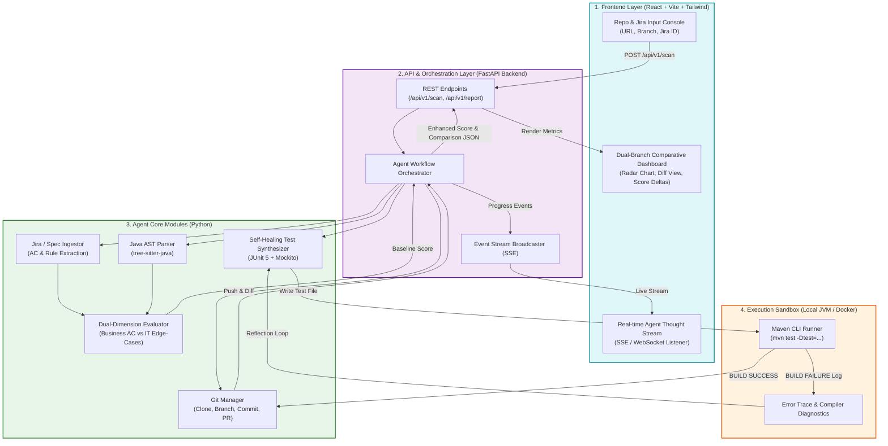
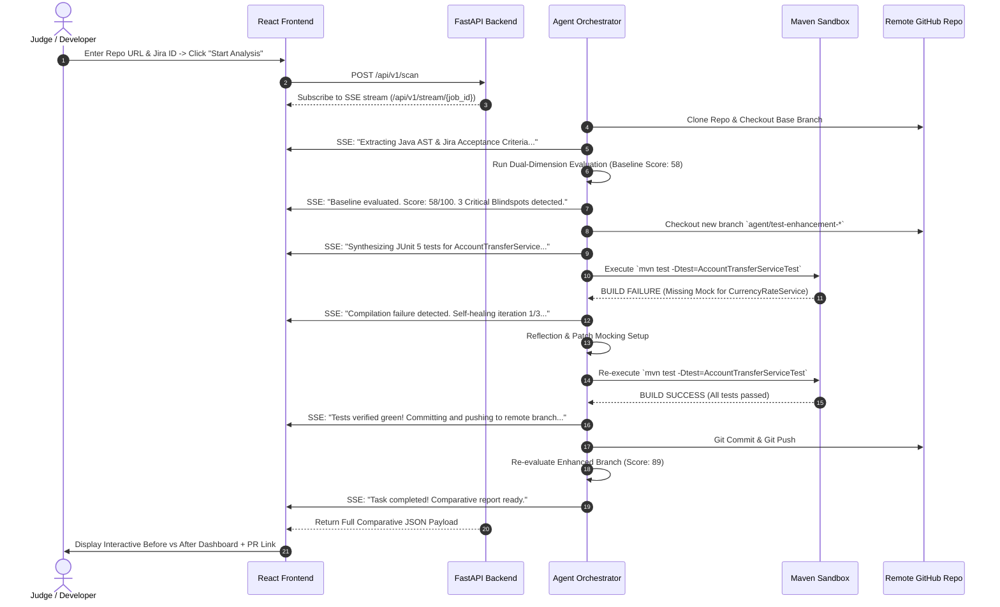

# System Architecture & Technical Implementation Document
**Project Name:** AutoTestAgent (SentinelQA)  
**Target Event:** Hackathon 2026  
**Architecture Style:** Decoupled Client-Server (React Frontend + FastAPI Backend)  
**Implementation Language:** Python 3.11+ (FastAPI & Agent Core) + TypeScript / React (Web Dashboard)  
**Target Testbeds:** Java 17/21 + Spring Boot (Maven / JUnit 5)  
**Document Version:** 1.1.0  
**Status:** Approved / In-Development  

---

## 1. Architectural Overview & Design Philosophy

AutoTestAgent adopts a **Decoupled Full-Stack Web Architecture** (`React Frontend + FastAPI Backend`). This design replaces traditional cold CLI commands with an intuitive, executive-friendly, and interactive Web application designed specifically for high-impact live demos and enterprise usability.

### Core Tenets:
1. **Decoupled Client-Server Model**:
   - **Frontend (React + Tailwind CSS + Lucide Icons + Recharts)**: Handles user input (GitHub Repo URL, Jira ID), renders real-time streaming agent thoughts/progress, and presents side-by-side comparative dashboards.
   - **Backend (FastAPI + Async Python 3.11)**: Orchestrates Git operations, AST parsing, LLM prompt pipelines, Maven CLI sandbox execution, and SSE (Server-Sent Events) streaming.
2. **Zero Production Mutation**: The agent strictly operates within `src/test/java/...` on an isolated Git branch (`agent/test-enhancement-*`).
3. **Deterministic Execution Sandbox**: All generated JUnit tests must achieve `BUILD SUCCESS` under `mvn test` before committing.
4. **Dual-Lens Quality Metrics**: Evaluates both Business Acceptance Criteria (AC traceability) and Technical Robustness (concurrency, null-checks, rollbacks).

---

## 2. End-to-End System Architecture (Mermaid)



---

## 3. Real-Time Interaction & Self-Healing Sequence (Mermaid)



---

## 4. Subsystem Detailed Specifications

### 4.1 Frontend Architecture (`web/`)
- **Technology Stack**: React 18, Vite, TypeScript, Tailwind CSS, Recharts (for radar and score trend charts), Lucide-React icons.
- **Views**:
  1. **Workbench / Launcher**: Clean, dark-themed hero console with GitHub URL, branch selection, and optional Jira ticket input.
  2. **Agent Live Console**: Terminal-style animated thought stream showing live tool invocations and self-healing iterations.
  3. **Comparative Dashboard**:
     - Score Delta banner (e.g., `58 -> 89 (+31)`).
     - 5-Axis Radar Chart (Business ACs, Concurrency/Locking, Boundary/Null, Upstream Circuit, Assertion Depth).
     - Itemized Acceptance Criteria Traceability Checklist.
     - Side-by-side Test Coverage Diff and Verified Execution Log.

### 4.2 Backend API Architecture (`server/` & `sentinel_qa/`)
- **Technology Stack**: FastAPI, Uvicorn, Pydantic v2, LiteLLM / Google GenAI SDK.
- **Key Endpoints**:
  - `POST /api/v1/scan`: Accepts `{ repo_url: str, branch: str, jira_id: Optional[str] }`, initializes asynchronous background task, returns `job_id`.
  - `GET /api/v1/stream/{job_id}`: Server-Sent Events (SSE) streaming progress milestones and agent logs.
  - `GET /api/v1/report/{job_id}`: Returns complete comparative report JSON for dashboard rendering.

### 4.3 Agent Core & Self-Healing Engine
- **AST Parsing (`core/java_ast.py`)**: Uses `tree-sitter-java` to extract classes, methods, annotations (`@Transactional`, `@Valid`), and existing test methods.
- **Evaluation Engine (`core/evaluator.py`)**: Implements the 3-pillar scoring model:
  $$\text{Score} = (0.40 \times S_{\text{Business}}) + (0.35 \times S_{\text{Resilience}}) + (0.25 \times S_{\text{Assertion}})$$
- **Self-Healing Loop (`core/self_healer.py`)**: Subprocess runner executing `mvn test`. Captures stack traces, triggers LLM reflection (max 3 tries), and ensures 100% green builds before commit.

---

## 5. Repository Directory Layout

```
auto-test-agent/
├── README.md                           # Project homepage & mission
├── docs/
│   ├── REQUIREMENTS.md                 # System Requirements Specification (SRS)
│   └── ARCHITECTURE.md                 # Full-Stack System Architecture Document
├── server/                             # FastAPI Backend Service
│   ├── app.py                          # FastAPI application & SSE routers
│   ├── api/                            # API route controllers
│   └── services/                       # Task runner & background job coordinator
├── web/                                # React Frontend Web App
│   ├── package.json
│   ├── vite.config.ts
│   ├── src/
│   │   ├── components/                 # Radar chart, diff table, stream console
│   │   ├── pages/                      # Launcher page, Dashboard page
│   │   └── App.tsx
├── sentinel_qa/                        # Agent Core Logic (Python)
│   ├── core/
│   │   ├── git_manager.py              # Git clone, branch, commit, push
│   │   ├── jira_parser.py              # Jira API connector & fallback doc parser
│   │   ├── java_ast.py                 # AST extraction via tree-sitter
│   │   ├── evaluator.py                # Dual-dimension scoring engine
│   │   ├── test_generator.py           # JUnit 5 test synthesizer
│   │   ├── sandbox_runner.py           # Subprocess wrapper for `mvn test`
│   │   └── self_healer.py              # Reflection & error correction loop
│   └── models/
│       ├── schema.py                   # Pydantic schemas (ACs, Scores, Diff)
│       └── prompts.py                  # Structured prompts with JSON guards
├── testbeds/                           # Demonstrative Java Sandboxes
│   └── spring-banking-demo/            # Target Spring Boot service with blindspots
├── pyproject.toml                      # Backend dependencies
└── docker-compose.yml                  # One-click startup for Demo
```

---

## 6. Technology Stack Summary

| Component | Technology | Rationale |
| :--- | :--- | :--- |
| **Frontend Framework** | React 18 + Vite (TypeScript) | High performance, rapid component assembly, and rich charting ecosystem. |
| **Styling & Icons** | Tailwind CSS + Lucide Icons | Modern, sleek dark-mode aesthetic suitable for executive presentations. |
| **Backend API** | FastAPI (Python 3.11+) | Native async support, auto-generated OpenAPI docs, and lightweight SSE streaming. |
| **Agent Logic** | Python 3.11+ + Pydantic v2 | Unmatched speed of iteration, AST extraction, and strict JSON validation. |
| **Java AST Extraction** | `tree-sitter` (`tree-sitter-java`) | High-speed C-native syntax tree parsing without JVM dependency. |
| **Target Testbed** | Java 17/21 + Spring Boot + Maven | Standard enterprise financial technology stack. |
| **Real-time Protocol** | Server-Sent Events (SSE) | Lightweight, unidirectional live event streaming for agent progress. |
