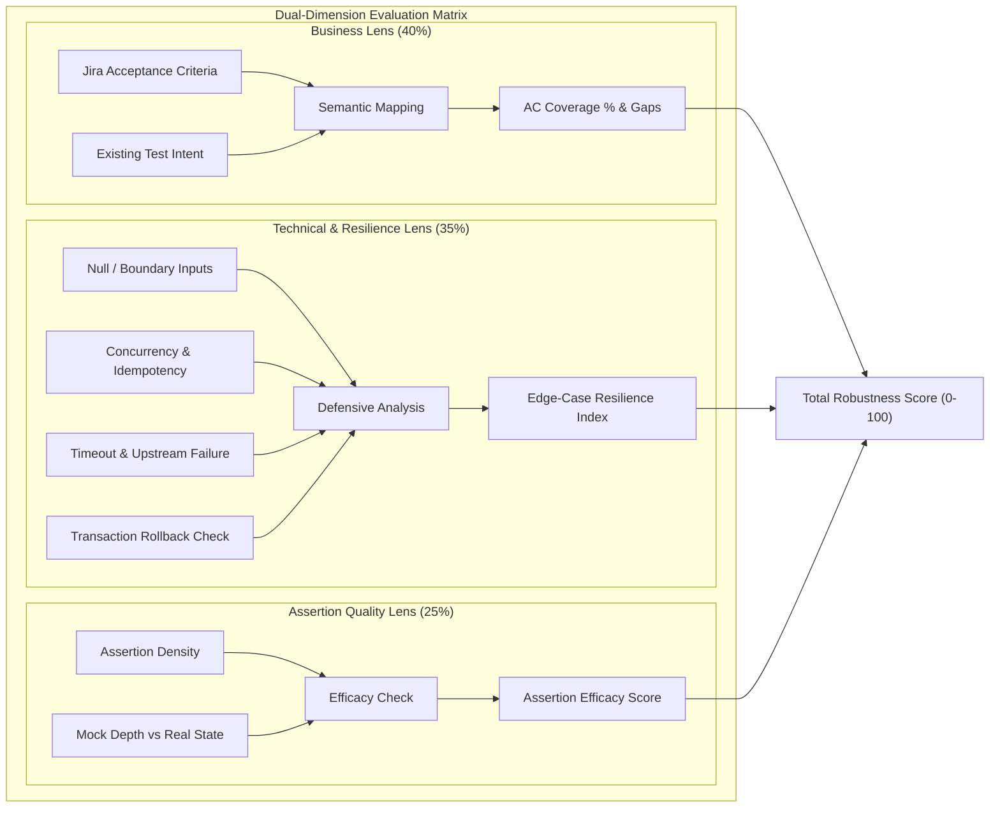
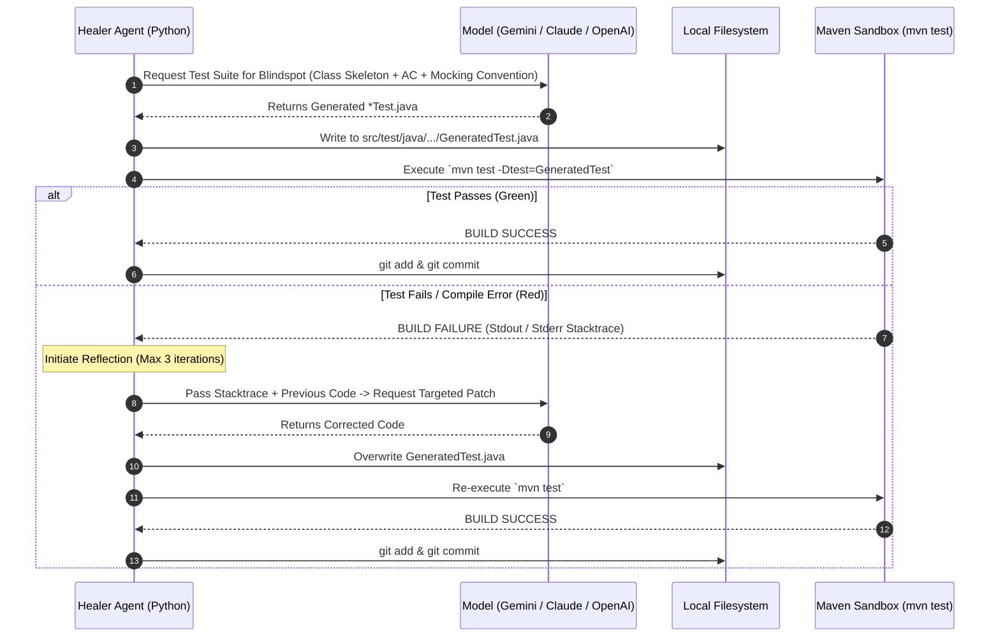

# System Architecture & Technical Implementation Document
**Project Name:** AutoTestAgent (SentinelQA)  
**Target Event:** Hackathon 2026  
**Implementation Language:** Python 3.11+ (Agent Core) targeting Java 17/21 + Spring Boot (Target Testbeds)  
**Document Version:** 1.0.0  
**Status:** Approved / In-Development  

---

## 1. Architectural Overview & Design Philosophy

AutoTestAgent adopts an asynchronous, modular pipeline architecture. The core agent orchestration engine is written in **Python 3.11+** for rapid LLM integration, lightweight AST analysis, and dynamic report synthesis. The targeted target environment is **Java (Spring Boot / Maven / JUnit 5)**, addressing the highest-value pain point in enterprise banking and fintech systems.

### Core Tenets:
1. **Zero Production Mutation**: The agent strictly mutates code in `src/test/java/...` under an isolated Git branch (`agent/test-enhancement-*`). Production business logic remains untouched.
2. **Deterministic Execution Sandbox**: Tests generated by LLMs are treated as untrusted until verified via `mvn test` in a sandboxed process loop.
3. **Dual-Lens Quality Metrics**: Separates structural syntax coverage from business acceptance criteria (AC) traceability.
4. **Self-Contained Executive Deliverables**: Generates an aesthetic, interactive, single-file HTML comparative dashboard (Tailwind CSS + Chart.js) that runs locally or in CI without external backend dependencies.

---

## 2. End-to-End System Architecture (Mermaid)

```mermaid
flowchart TB
    subgraph Ingestion["1. Ingestion & Preprocessing"]
        A[Git Repository URL] --> B[Git Cloner & Branch Manager]
        C[Jira Issue / Local Spec / README] --> D[Requirement & AC Parser]
        B --> E[Java AST Parser\ntree-sitter / javalang]
    end

    subgraph CoreEngine["2. Agent Core Orchestrator (Python)"]
        E --> F[Code Structure Extractor\nClasses, Methods, Annotations, Tests]
        D --> G[Semantic Requirement Matrix]
        F & G --> H[Dual-Dimension Semantic Evaluator]
        H --> I[Robustness Scoring Engine\nBusiness 40% | Edge 35% | Assert 25%]
        I --> J[Baseline Quality Report\nOriginal Branch Score]
    end

    subgraph SelfHealing["3. Self-Healing Test Generation Loop"]
        J --> K{Critical Blindspots\nDetected?}
        K -- Yes --> L[Branch Checkout\nagent/test-enhancement-*]
        L --> M[JUnit 5 + Mockito Test Synthesizer]
        M --> N[Local Sandbox Runner\nmvn test -Dtest=...]
        N --> O{Build & Tests\nPassed?}
        O -- No (Max 3 Tries) --> P[Reflection & Diagnostics\nCompiler / Assertion Trace]
        P --> M
        O -- Yes --> Q[Git Commit & Push\nEnhanced Branch]
    end

    subgraph Analytics["4. Comparative Analytics & Visualizer"]
        Q --> R[Post-Enhancement Evaluator\nNew Branch Score]
        J & R --> S[Comparative Diff Engine]
        S --> T[Interactive Executive Dashboard\nHTML + Tailwind + Chart.js]
        T --> U[Auto-Generated GitHub PR\nWith Embedded Summary]
    end

    classDef ing fill:#e1f5fe,stroke:#0288d1,stroke-width:2px;
    classDef core fill:#ede7f6,stroke:#512da8,stroke-width:2px;
    classDef heal fill:#e8f5e9,stroke:#2e7d32,stroke-width:2px;
    classDef viz fill:#fff3e0,stroke:#f57c00,stroke-width:2px;

    class Ingestion ing;
    class CoreEngine core;
    class SelfHealing heal;
    class Analytics viz;
```

---

## 3. Subsystem Detailed Design

### 3.1 Ingestion & Context Parsing Subsystem (`core.ingestion`)
- **Git Manager**: Uses `GitPython` or direct subprocess wrappers to clone repositories, inspect branches, create target feature branches, and manage staging/commits.
- **Requirement & AC Ingestor**:
  - Accepts Jira Issue Key (fetches via Jira REST API) or parses repository markdown specs (`docs/`, `README.md`, `specs/`).
  - Employs an LLM extraction prompt with Pydantic output schema to structure requirements into explicit Acceptance Criteria:
    ```json
    {
      "ac_id": "AC-01",
      "category": "BUSINESS_RULE",
      "summary": "Transfer amount must not exceed single-transaction limit of 50,000 USD",
      "expected_behavior": "Throws TransactionLimitExceededException and triggers rollback",
      "criticality": "HIGH"
    }
    ```
- **Java AST & Skeleton Extractor**:
  - Uses `tree-sitter-java` or `javalang` to parse `.java` files under `src/main/java` and `src/test/java`.
  - Extracts public classes, methods, `@Transactional`, `@Valid`, exception handlers, and existing `@Test` methods.
  - Outputs a compressed Code Skeleton, avoiding huge token dumps.

---

### 3.2 Dual-Dimension Semantic Evaluator (`core.evaluator`)

The evaluator scores the project across two distinct lenses:



#### The Robustness Scoring Formula:
$$\text{Score} = (0.40 \times S_{\text{Business}}) + (0.35 \times S_{\text{Resilience}}) + (0.25 \times S_{\text{Assertion}})$$

- $S_{\text{Business}}$: Percentage of documented Acceptance Criteria matched against verified assertions.
- $S_{\text{Resilience}}$: Ratio of handled fault paths (NPE, concurrency, rollback, timeouts) covered in test methods.
- $S_{\text{Assertion}}$: Ratio of effective state/exception assertions versus hollow invocations.

---

### 3.3 Autonomous Test Synthesizer & Self-Healing Loop (`core.healer`)

The generation loop ensures zero non-compiling or failing code is ever committed to the repository.



#### Self-Healing Rules:
- **Sandbox Isolation**: Each run executes in a dedicated worktree or isolated container.
- **Fail-Safe Circuit Breaker**: If after 3 reflection cycles a generated test cannot achieve `BUILD SUCCESS`, the agent discards that specific test file, logs the failure reason, and preserves repository stability.

---

### 3.4 Dual Dashboard & Visualizer (`core.visualizer`)

The agent compiles the before/after evaluation JSON into an **interactive, modern single-page dashboard** (`robustness_report.html`):

```
+----------------------------------------------------------------------------------------------------+
|  🛡️ SentinelQA: Robustness Comparative Dashboard                                                  |
|  Repo: nvd11/spring-banking-demo | Base: main | Enhanced: agent/test-enhancement-20260916         |
+----------------------------------------------------------------------------------------------------+
|  [Overall Robustness Score]                                                                        |
|   Baseline: 58 / 100  =======>  Enhanced: 89 / 100   (+31 Delta)                                   |
+----------------------------------------------------------------------------------------------------+
|  [Radar Chart: 5-Axis Capability]               |  [Business AC Verification Matrix]               |
|  - Business AC Alignment (45% -> 92%)           |  - [x] AC-01: Single Limit Check [VERIFIED]      |
|  - Concurrency & Locking (30% -> 85%)           |  - [x] AC-02: Insufficient Funds Rollback [VERIFIED]
|  - Null / Empty Boundary (60% -> 95%)           |  - [x] AC-03: Concurrent Deadlock Defense [NEW]  |
|  - Upstream Timeout Circuit (40% -> 80%)        |  - [!] AC-04: KYC Suspension Warning [MANUAL]    |
|  - Assertion Mutation Depth (55% -> 88%)        |                                                  |
+----------------------------------------------------------------------------------------------------+
|  [Self-Healed Test Suites & Execution Audit]                                                       |
|  - AccountTransferServiceTest.java (+4 tests, 2 self-healing cycles resolved)                      |
|  - [View Generated Code Diff]  |  [View Maven Green Execution Log]                                 |
+----------------------------------------------------------------------------------------------------+
```

---

## 4. Module & Directory Layout

```
auto-test-agent/
├── README.md                           # Project homepage & mission
├── docs/
│   ├── REQUIREMENTS.md                 # System Requirements Specification (SRS)
│   └── ARCHITECTURE.md                 # This architecture document
├── sentinel_qa/                        # Python Core Package
│   ├── __init__.py
│   ├── cli.py                          # CLI entry point (`sentinel-qa scan ...`)
│   ├── config.py                       # Configuration & API Key management
│   ├── core/
│   │   ├── git_manager.py              # Git clone, branch, commit, diff utilities
│   │   ├── jira_parser.py              # Jira API connector & fallback doc parser
│   │   ├── java_ast.py                 # Java AST extraction (tree-sitter/javalang)
│   │   ├── evaluator.py                # Dual-dimension scoring & matrix generation
│   │   ├── test_generator.py           # LLM test synthesizer (JUnit 5 + Mockito)
│   │   ├── sandbox_runner.py           # Subprocess wrapper for `mvn test` execution
│   │   ├── self_healer.py              # Reflection and error correction loop
│   │   └── visualizer.py               # Jinja2 template renderer for HTML dashboard
│   ├── templates/
│   │   └── dashboard_template.html     # Tailwind CSS + Chart.js visualizer
│   └── models/
│       ├── schema.py                   # Pydantic schemas (ACs, Scores, Blindspots)
│       └── prompts.py                  # Structured prompts with JSON Schema guards
├── testbeds/                           # Demonstrative Java Sandboxes
│   └── spring-banking-demo/            # Banking transfer service with deliberate blindspots
├── pyproject.toml                      # Python dependencies (click, pydantic, jinja2, etc.)
└── tests/                              # Unit tests for the agent itself
```

---

## 5. Technology Stack Selection

| Component | Technology / Library | Rationale |
| :--- | :--- | :--- |
| **Agent Language** | Python 3.11+ | Unmatched speed of iteration, LLM API integration, AST parsing, and dashboard templating. |
| **LLM Provider** | OpenAI / Gemini 1.5 / Claude | Configurable via LiteLLM / direct SDK with strict Pydantic JSON mode. |
| **Java AST Parsing** | `tree-sitter` (tree-sitter-java) | Blazing-fast C-native parsing without JVM runtime overhead. |
| **Target Build System** | Apache Maven / Gradle | Standard enterprise Java tooling; direct CLI integration (`mvn test`). |
| **Dashboard UI** | HTML5, Tailwind CSS, Chart.js | Zero-dependency, single-file distribution; visually stunning for live hackathon pitches. |
| **Git Operations** | `GitPython` / Native Git CLI | Reliable branch management and diff calculation. |
