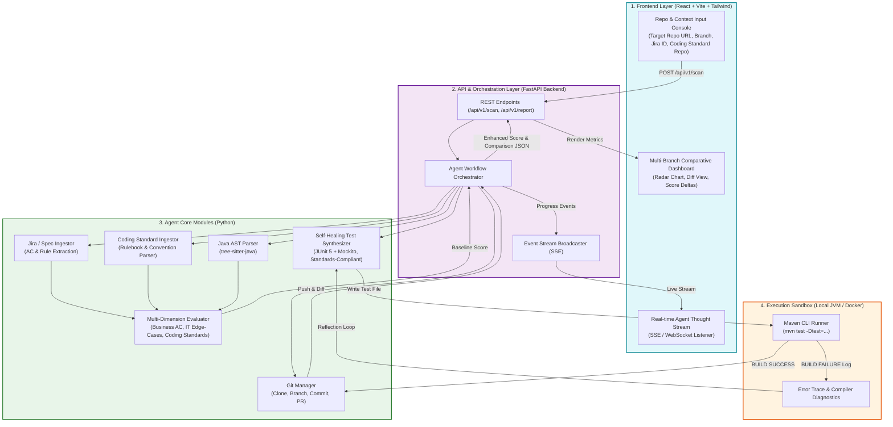
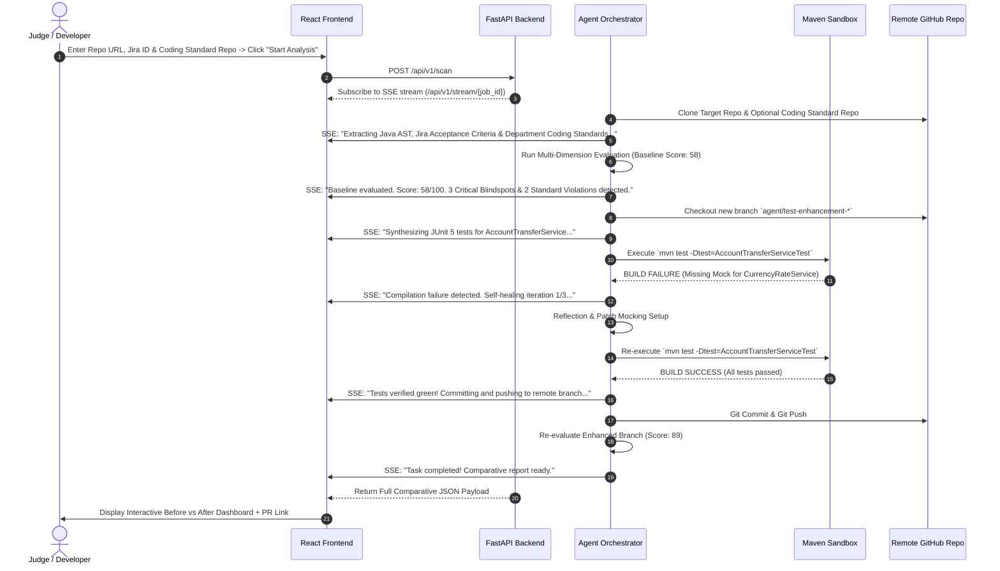

# System Architecture & Technical Implementation Document
**Project Name:** AutoTestAgent (SentinelQA)  
**Target Event:** Hackathon 2026  
**Architecture Style:** Decoupled Client-Server (React Frontend + FastAPI Backend)  
Implementation Language: Python 3.12 (FastAPI & LangChain Agent Core, pip-managed) + TypeScript / React (Web Dashboard)
**Target Testbeds:** Java 17/21 + Spring Boot (Maven / JUnit 5)  
**Document Version:** 1.1.0  
**Status:** Approved / In-Development  

---

## 1. Architectural Overview & Design Philosophy

AutoTestAgent adopts a **Decoupled Full-Stack Web Architecture** (`React Frontend + FastAPI Backend`). This design replaces traditional cold CLI commands with an intuitive, executive-friendly, and interactive Web application designed specifically for high-impact live demos and enterprise usability.

### Core Tenets:
1. **Decoupled Client-Server Model**:
   - **Frontend (React + Tailwind CSS + Lucide Icons + Recharts)**: Handles user input (Target GitHub Repo URL, optional Jira ID, and optional Coding Standard Repo URL), renders real-time streaming agent thoughts/progress, and presents side-by-side comparative dashboards.
   - Backend (FastAPI + Async Python 3.12, pip, LangChain Agent): Orchestrates Git operations for both target codebase and coding standards, AST parsing, LLM prompt pipelines, Maven CLI sandbox execution, and SSE (Server-Sent Events) streaming.
- Configuration Management: Standardized via `.env-template` supporting multi-environment setup (local, dev, prod).
2. **Zero Production Mutation**: The agent strictly operates within `src/test/java/...` on an isolated Git branch (`agent/test-enhancement-*`).
3. **Deterministic Execution Sandbox**: All generated JUnit tests must achieve `BUILD SUCCESS` under `mvn test` before committing.
4. **Multi-Lens Quality Metrics**: Evaluates Business Acceptance Criteria (AC traceability), Technical Robustness (concurrency, null-checks, rollbacks), and Department Coding Standard Compliance.

---

## 2. End-to-End System Architecture (Mermaid)



---

## 3. Real-Time Interaction & Self-Healing Sequence (Mermaid)



---

## 4. Subsystem Detailed Specifications

### 4.1 Frontend Architecture (`web/`)
- **Technology Stack**: React 18, Vite, TypeScript, Tailwind CSS, Recharts (for radar and score trend charts), Lucide-React icons.
- **Views**:
  1. **Workbench / Launcher**: Clean, dark-themed hero console with Target GitHub URL, branch selection, optional Jira ticket input, and optional Department Coding Standard GitHub URL.
  2. **Agent Live Console**: Terminal-style animated thought stream showing live tool invocations, standard rulebook ingestion, and self-healing iterations.
  3. **Comparative Dashboard**:
     - Score Delta banner (e.g., `58 -> 89 (+31)`).
     - 5-Axis Radar Chart (Business ACs, Concurrency/Locking, Boundary/Null, Coding Standard Compliance, Assertion Depth).
     - Itemized Acceptance Criteria Traceability Checklist & Coding Standard Audit.
     - Side-by-side Test Coverage Diff and Verified Execution Log.

### 4.2 Backend API Architecture (`server/` & `sentinel_qa/`)
- **Technology Stack**: FastAPI, Uvicorn, Pydantic v2, LiteLLM / Google GenAI SDK, LangChain.
- **Key Endpoints**:
  - `POST /api/v1/scan`: Accepts `{ repo_url: str, branch: str, jira_id: Optional[str], standard_repo_url: Optional[str] }`, initializes asynchronous background task, returns `job_id`.
  - `GET /api/v1/stream/{job_id}`: Server-Sent Events (SSE) streaming progress milestones, standard ingestion, and agent logs.
  - `GET /api/v1/report/{job_id}`: Returns complete comparative report JSON for dashboard rendering.

### 4.3 Agent Core & Self-Healing Engine
- **AST Parsing (`core/java_ast.py`)**: Uses `tree-sitter-java` to extract classes, methods, annotations (`@Transactional`, `@Valid`), and existing test methods.
- **Coding Standard Ingestor (`engine/coding_standard_client.py`)**: Clones and indexes department-level coding guidelines (e.g., test naming patterns, required assertion libraries like AssertJ, structure guidelines, exception handling patterns).
- **Evaluation Engine (`core/evaluator.py`)**: Implements the 4-pillar scoring model:
  $$\text{Score} = (0.35 \times S_{\text{Business}}) + (0.35 \times S_{\text{Resilience}}) + (0.15 \times S_{\text{Standards}}) + (0.15 \times S_{\text{Assertion}})$$
- **Self-Healing Loop (`core/self_healer.py`)**: Subprocess runner executing `mvn test`. Captures stack traces, triggers LLM reflection (max 3 tries), and ensures 100% green builds adhering to department guidelines before commit.

---

## 5. Repository Directory Layout

```
auto-test-agent/
├── README.md                           # Project homepage & mission
├── docs/
│   ├── REQUIREMENTS.md                 # System Requirements Specification (SRS)
│   └── ARCHITECTURE.md                 # Full-Stack System Architecture Document
├── web/                                # React Frontend Web App (Vite + TypeScript)
│   ├── package.json
│   ├── vite.config.ts
│   └── src/
│       ├── components/                 # Radar chart, diff table, stream console
│       ├── pages/                      # Launcher page, Dashboard page
│       └── App.tsx
├── backend/                            # FastAPI Backend (Following python-template-v2)
│   ├── requirements.txt                # Standard pip dependencies (Python 3.12 + pip)
│   ├── Dockerfile
│   ├── src/
│   │   ├── __init__.py
│   │   ├── main.py                     # Entry point for local/dev runner
│   │   ├── server.py                   # FastAPI app factory, CORS, lifespan
│   │   ├── configs/                    # Multi-environment configuration system
│   │   │   ├── __init__.py
│   │   │   ├── config.py               # Pydantic Settings, YAML loader, APP_ENVIRONMENT
│   │   │   ├── config_local.yaml       # Local dev config (proxy, debug logs)
│   │   │   ├── config_dev.yaml         # Dev environment config
│   │   │   ├── config_prod.yaml        # Prod environment config
│   │   │   ├── log_config.py           # Loguru config (GCP JSON in prod, color in dev)
│   │   │   └── proxy.py                # Local proxy helpers
│   │   ├── models/                     # Request/Response schemas & domain entities
│   │   │   ├── __init__.py
│   │   │   ├── requests.py             # ScanRequest (repo_url, branch, jira_id, standard_repo_url)
│   │   │   ├── responses.py            # ScanResponse, StreamEvent, ReportResponse
│   │   │   └── domain.py               # AcceptanceCriteria, CodingStandardRule, RobustnessScore, DiffMatrix
│   │   ├── routers/                    # FastAPI route controllers
│   │   │   ├── __init__.py
│   │   │   ├── health.py               # Health check endpoint (/health)
│   │   │   ├── scan.py                 # Scan triggers & SSE streaming (/api/v1/scan, /api/v1/stream)
│   │   │   └── report.py               # Comparative report endpoints (/api/v1/report)
│   │   ├── services/                   # Business & orchestrator services
│   │   │   ├── __init__.py
│   │   │   └── scan_service.py         # Async task coordinator & SSE event emitter
│   │   ├── llm/                        # LLM provider clients, prompt templates & token handling
│   │   │   ├── __init__.py
│   │   │   ├── client.py               # LiteLLM / Gemini client wrapper & fallback handling
│   │   │   └── prompts.py              # Prompt templates for evaluation, synthesis & reflection
│   │   ├── agent/                      # Core agent workflows, state machines & self-healing
│   │   │   ├── __init__.py
│   │   │   ├── orchestrator.py         # Autonomous workflow controller
│   │   │   ├── evaluator.py            # Dual-dimension semantic evaluator
│   │   │   ├── synthesizer.py          # JUnit 5 & Mockito test generator
│   │   │   └── self_healer.py          # Test runner & feedback reflection loop
│   │   ├── engine/                     # Toolings, parsers & sandbox execution runners
│   │   │   ├── __init__.py
│   │   │   ├── git_client.py           # Git operations (clone, branch, commit, push)
│   │   │   ├── jira_client.py          # Jira API & fallback doc extractor
│   │   │   ├── coding_standard_client.py # Department Coding Standard repository fetcher & indexer
│   │   │   ├── java_ast_parser.py      # tree-sitter Java AST parser
│   │   │   └── maven_sandbox.py        # Subprocess `mvn test` execution & reflection loop
│   │   └── utils/                      # Shared helpers
│   │       ├── __init__.py
│   │       ├── path_utils.py           # Project & workspace directory helpers
│   │       └── validators.py           # Git URL & Jira ID sanitizers
│   └── test/                           # Pytest suite for backend
├── testbeds/                           # Demonstrative Java Sandboxes
│   └── spring-banking-demo/            # Target Spring Boot service with deliberate blindspots
└── cloudbuild.yaml                     # GCP Cloud Build pipeline for deploying to Cloud Run
```

---

## 6. Technology Stack Summary

| Component | Technology | Rationale |
| :--- | :--- | :--- |
| **Frontend Framework** | React 18 + Vite (TypeScript) | High performance, rapid component assembly, and rich charting ecosystem. |
| **Styling & Icons** | Tailwind CSS + Lucide Icons | Modern, sleek dark-mode aesthetic suitable for executive presentations. |
| **Backend API** | FastAPI (Python 3.12, pip) | Native async support, auto-generated OpenAPI docs, and lightweight SSE streaming. |
| **Agent Logic** | Python 3.12 + Pydantic v2 | Unmatched speed of iteration, AST extraction, and strict JSON validation. Managed via pip. |
| **Java AST Extraction** | `tree-sitter` (`tree-sitter-java`) | High-speed C-native syntax tree parsing without JVM dependency. |
| **Target Testbed** | Java 17/21 + Spring Boot + Maven | Standard enterprise financial technology stack. |
| **Real-time Protocol** | Server-Sent Events (SSE) | Lightweight, unidirectional live event streaming for agent progress. |
